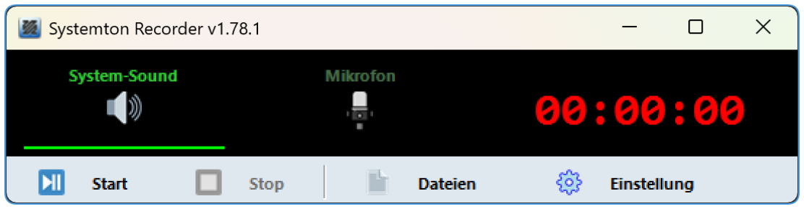
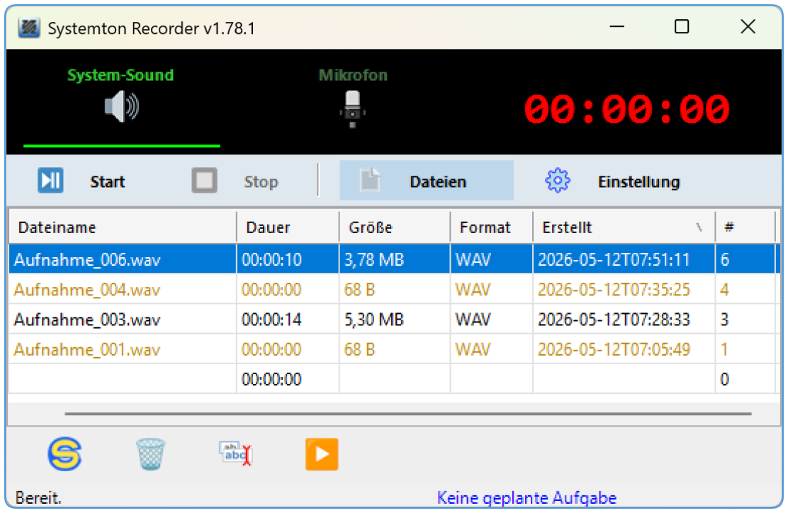
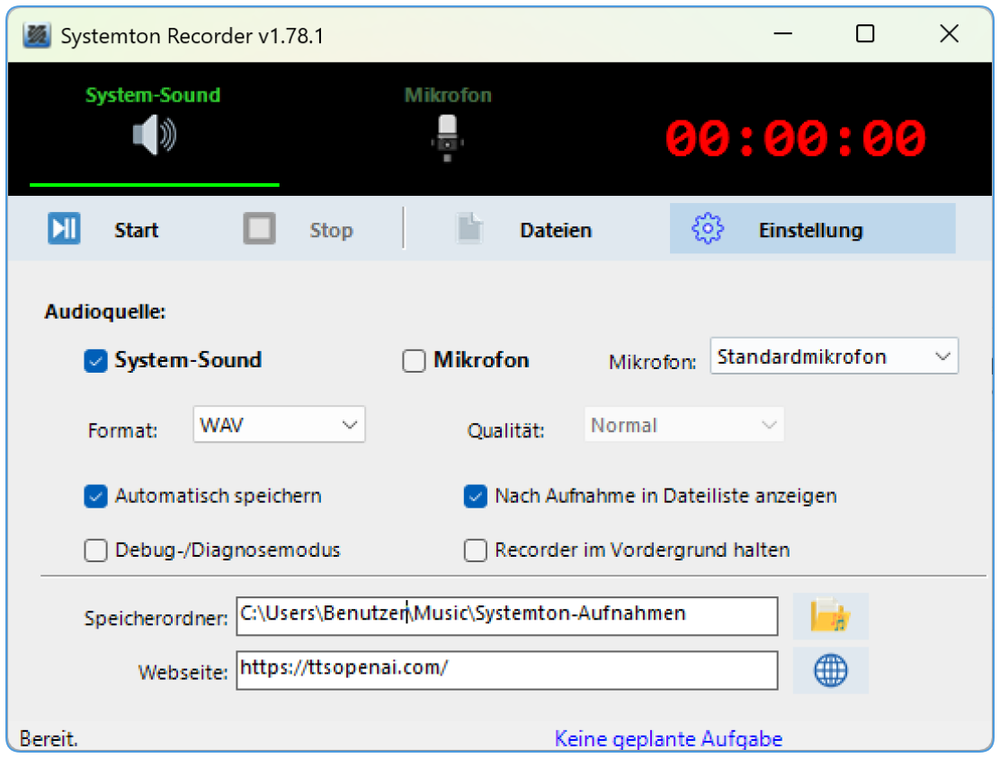

# Systemton Recorder



## Warum es diesen Recorder gibt

Vor ein paar Tagen wollte ich mehrere Textdateien als Audio aufnehmen. Dafür hatte ich zunächst den „Apowersoft – Audiorekorder“ genutzt. Das Programm hat dann aber den Dienst verweigert. Da mir das grundsätzliche Layout eines kleinen Audiorecorders gut gefiel, habe ich daraus eine eigene, einfache Recorder-Anwendung gebaut.

Viele im Netz verfügbare Audiorekorder nehmen sehr viel Platz auf dem Desktop ein. Genau das wollte ich vermeiden. Der **Systemton Recorder** ist deshalb bewusst klein gehalten, lässt sich schnell bedienen und kann trotzdem die wichtigsten Aufgaben erledigen.

Der Recorder kann Systemton und Mikrofon aufnehmen, die Audiodateien speichern, vorhandene Aufnahmen anzeigen, abspielen, löschen, umbenennen und direkt zur gespeicherten Datei springen.

Ein besonderer Vorteil ist die Zusammenarbeit mit dem **SpeedCommander**. Dafür gibt es ein eigenes SpeedCommander-Makro, das den Recorder komfortabel startet und nach dem Beenden des Recorders die zuvor geöffneten Ordner und markierten Dateien wiederherstellt.

Für Nutzer ohne SpeedCommander sind zusätzlich zwei BAT-Startdateien enthalten.

---

## Ansichten

### Dateiliste



In der Dateiansicht werden die gespeicherten Aufnahmen angezeigt. Dort sieht man Dateiname, Dauer, Größe, Format, Erstellungsdatum und Nummer der Aufnahme.

Über die Symbolleiste unter der Tabelle können Aufnahmen direkt geöffnet, gelöscht, umbenannt oder abgespielt werden.

### Einstellungen



In den Einstellungen wird festgelegt, welche Audioquelle aufgenommen wird, welches Format verwendet wird und in welchem Ordner die Dateien gespeichert werden.

### Kompaktansicht


Die Kompaktansicht benötigt nur wenig Platz auf dem Desktop. Sie ist für den laufenden Betrieb gedacht, wenn der Recorder nur bereitstehen oder aufnehmen soll.

---

## Hauptfunktionen

- Aufnahme von **System-Sound**
- Aufnahme von **Mikrofon**
- Aufnahme von System-Sound und Mikrofon gemeinsam
- Speichern als WAV, MP3 oder M4A, je nach eingestelltem Format
- Anzeige der aufgenommenen Dateien in einer Tabelle
- Abspielen gespeicherter Aufnahmen direkt im Recorder
- Löschen gespeicherter Aufnahmen
- Umbenennen gespeicherter Aufnahmen
- Sprung zur gespeicherten Datei im SpeedCommander
- Explorer-Fallback, wenn der Recorder ohne SpeedCommander gestartet wurde
- kompakte Oberfläche mit geringer Bildschirmhöhe
- optionaler Vordergrundmodus
- optionaler Debug-/Diagnosemodus

---

## Bedienung mit Tastatur

Der Recorder ist so aufgebaut, dass er auch ohne Maus gut bedient werden kann.

### Aufnahme

| Tastenkombination | Funktion |
|---|---|
| `Alt + S` | Aufnahme starten |
| `Leertaste` | Aufnahme pausieren |
| `Leertaste` | Aufnahme fortsetzen |
| `Esc` | Aufnahme stoppen |

### Ansichten

| Tastenkombination | Funktion |
|---|---|
| `Strg + D` | Dateiliste anzeigen |
| `Strg + E` | Einstellungen anzeigen |

### Dateiliste

| Tastenkombination | Funktion |
|---|---|
| `Strg + Q` | Zur markierten Datei springen |
| `Strg + L` | Markierte Aufnahme löschen |
| `Strg + U` | Markierte Aufnahme umbenennen |
| `Strg + P` | Markierte Aufnahme abspielen |
| `Esc` | Wiedergabe stoppen |

### Einstellungen

| Tastenkombination | Funktion |
|---|---|
| `Alt + S` | System-Sound ein-/ausschalten |
| `Alt + M` | Mikrofon ein-/ausschalten |
| `Alt + F` | Format auswählen |
| `Alt + Q` | Qualität auswählen |
| `Alt + A` | Automatisch speichern ein-/ausschalten |
| `Alt + N` | Nach Aufnahme in Dateiliste anzeigen ein-/ausschalten |
| `Alt + D` | Debug-/Diagnosemodus ein-/ausschalten |
| `Alt + R` | Recorder im Vordergrund halten ein-/ausschalten |
| `Strg + O` | Speicherordner auswählen |
| `Alt + W` | Webseitenfeld bearbeiten |
| `Strg + Alt + Q` | Webseite öffnen |

---

## SpeedCommander-Unterstützung

Der Recorder kann über ein SpeedCommander-Makro gestartet werden.

Das Makro übergibt an den Recorder unter anderem:

- Startart: SpeedCommander
- Pfad zur `SpeedCommander.exe`
- SpeedCommander-Version, soweit ermittelbar
- aktives Fenster
- aktive Auswahl
- fokussierte Datei
- inaktives Fenster, soweit verfügbar
- Auswahl im inaktiven Fenster, soweit verfügbar
- Logdatei

Dadurch kann der Recorder beim Sprung zu einer Aufnahme direkt den SpeedCommander verwenden:

```text
SpeedCommander.exe "<Pfad der zu selektierenden Datei>"
```

Beim Beenden des Recorders stellt das Makro die zuvor geöffneten Ordner und die vorherige Auswahl wieder her.

---

## Start ohne SpeedCommander

Wenn der Recorder über eine BAT-Datei gestartet wird, erkennt er diese Startart als normalen BAT-Start.

In diesem Fall wird beim Sprung zu einer Aufnahme nicht der SpeedCommander verwendet, sondern der Windows Explorer:

```text
explorer.exe /select,"<Datei>"
```

Dafür sind zwei BAT-Dateien vorgesehen:

| Datei | Verhalten |
|---|---|
| `GUI-State-OPEN.bat` | Konsole bleibt offen, bis der Recorder beendet wird |
| `GUI-State-MINIMIZE.bat` | Konsole schließt sich direkt nach dem Start |

---

## Optional: SVG-Unterstützung

Die Anwendung kann PNG-Symbole direkt verwenden. Zusätzlich können SVG-Dateien als Quelle für Symbole genutzt werden.

Die Datei `Svg.dll` ist optional. Sie gehört in den Ordner:

```text
lib\Svg.dll
```

Zum Herunterladen kann die BAT-Datei im `lib`-Ordner verwendet werden:

```text
lib\SvgDll-laden.bat
```

Wenn `Svg.dll` fehlt, soll der Recorder trotzdem mit den vorhandenen PNG-Symbolen funktionieren.

---

## Enthaltene wichtige Dateien

| Datei / Ordner | Bedeutung |
|---|---|
| `SystemtonRecorderGUI.ps1` | Hauptprogramm |
| `recorder-config.json` | Einstellungen und Icon-Konfiguration |
| `recordings-index.json` | Index der aufgenommenen Dateien |
| `SpeedCommanderMP3Starter.scmac` | SpeedCommander-Makro |
| `GUI-State-OPEN.bat` | BAT-Start mit sichtbarer Konsole |
| `GUI-State-MINIMIZE.bat` | BAT-Start mit sofort schließender Konsole |
| `assets/` | Symbole und Bilder |
| `lib/` | optionale Zusatzdateien wie `Svg.dll` |
| `LICENSE.txt` | Lizenz |
| `LIZENZHINWEIS.md` | kurzer deutscher Lizenzhinweis |

---

## Lizenz

Autor: **Lutz Müller (gabischatz)**

Lizenz: **CC BY 4.0**

Lizenzlink:

```text
https://creativecommons.org/licenses/by/4.0/deed.de
```

Empfohlene Namensnennung:

> Systemton Recorder von Lutz Müller (gabischatz), lizenziert unter CC BY 4.0.
